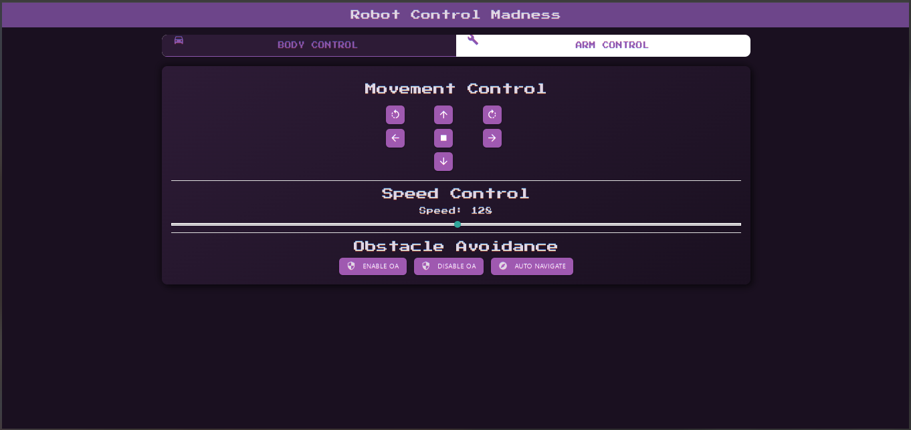
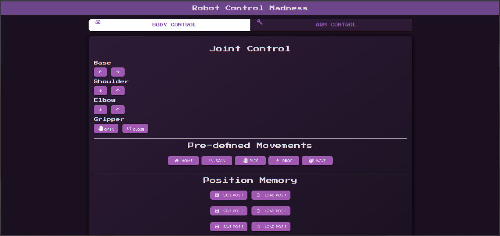

# Robot Control with Web Interface

This project enables control of a robot with obstacle avoidance and a robot arm through a web interface using an ESP8266/esp32. The controller connects to Wi-Fi and accepts HTTP commands to manage the motor, robot arm, and sensors.

## Features

### Main
- **Wi-Fi Control**: Control the robot over a Wi-Fi network using a web interface.
- **Obstacle Avoidance**: Uses ultrasonic sensor data to automatically avoid obstacles.
- **Robot Arm Control**: Manage various robotic arm movements, including a gripper, base rotation, and joint movements.
- **Configurable Speed**: Set motor speed through the web interface.
- **Position Management**: Save and execute robot arm positions, along with predefined actions like scanning, picking, and waving.
- **Motor Control**: Forward, backward, turn, and stop commands.
- **mDNS Support**: Access the device using a hostname (e.g., `http://serbot.local`).

### Parts

#### Body Control
- **Directional Movement**
  - Forward/Backward movement
  - Left/Right turns
  - Rotate left/right
  - Emergency stop
- **Speed Control**
  - Adjustable speed via slider (0-255)
- **Obstacle Avoidance**
  - Enable/Disable obstacle avoidance
  - Autonomous navigation mode

#### Arm Control
- **Joint Control**
  - Base rotation (left/right)
  - Shoulder movement (up/down)
  - Elbow movement (up/down)
  - Gripper control (open/close)
- **Pre-defined Movements**
  - Home position
  - Scan position
  - Pick object
  - Drop object
  - Wave gesture
- **Position Memory**
  - Save up to 3 custom positions
  - Load saved positions
- **Command Recording**
  - Record movement sequences
  - Play recorded sequences
  - Clear recordings

## Hardware Requirements

- **ESP8266 (NodeMCU or similar)** or **ESP32**
- **Motor Driver (L298N recommended)**
- **Ultrasonic Sensor (HC-SR04)**
- **Servos (for robot arm joints and gripper)**
- **Power Supply (suitable for motors and servos)**

## Pin Configuration

The table below lists the GPIO configurations for ESP8266 and ESP32. The board selector in the code (`bool isESP32`) should be set to `true` for ESP32 and `false` for ESP8266.


### Motor Controller Pins

| Component             | ESP8266 GPIO | ESP8266 Alias | ESP32 GPIO | ESP32 Alias | Description                           |
|-----------------------|--------------|---------------|------------|-------------|---------------------------------------|
| Motor 1 IN1           | GPIO5        | D1            | GPIO25     | IO25        | Motor 1 Direction Control Pin 1       |
| Motor 1 IN2           | GPIO4        | D2            | GPIO26     | IO26        | Motor 1 Direction Control Pin 2       |
| Motor 2 IN1           | GPIO0        | D3            | GPIO27     | IO27        | Motor 2 Direction Control Pin 1       |
| Motor 2 IN2           | GPIO2        | D4            | GPIO14     | IO14        | Motor 2 Direction Control Pin 2       |
| Motor 1 Enable (ENA)  | GPIO14       | D5            | GPIO12     | IO12        | PWM pin for Motor 1 speed control     |
| Motor 2 Enable (ENB)  | GPIO12       | D6            | GPIO13     | IO13        | PWM pin for Motor 2 speed control     |


### Ultrasonic Sensor Pins

| Component             | ESP8266 GPIO | ESP8266 Alias | ESP32 GPIO | ESP32 Alias | Description                           |
|-----------------------|--------------|---------------|------------|-------------|---------------------------------------|
| Trigger Pin           | GPIO13       | D7            | GPIO32     | IO32        | Trigger for distance measurement      |
| Echo Pin              | GPIO15       | D8            | GPIO33     | IO33        | Echo to receive distance              |


### Robot Arm Pins

| Component             | ESP8266 GPIO | ESP8266 Alias | ESP32 GPIO | ESP32 Alias | Description                           |
|-----------------------|--------------|---------------|------------|-------------|---------------------------------------|
| Base Servo            | GPIO16       | D0            | GPIO17     | IO17        | Base rotation control                 |
| Shoulder Servo        | GPIO3 (RX)   | RX            | GPIO18     | IO18        | Shoulder joint control                |
| Elbow Servo           | GPIO1 (TX)   | TX            | GPIO19     | IO19        | Elbow joint control                   |
| Gripper Servo         | GPIO9        | SD2 / S2      | GPIO21     | IO21        | Gripper open/close control            |


### Notes:

- **Aliases for ESP8266**: NodeMCU board pins (e.g., D1, D2) map to ESP8266 GPIO pins.
- **Aliases for ESP32**: Use `IO` followed by the GPIO number as a naming convention.
- **Special Pins**: GPIO9 (SD2 on ESP8266) and GPIO10 (SD3) are typically used for flash operations on ESP8266. Use these cautiously.
- **PWM on ESP32**: ESP32 supports multiple PWM channels, improving servo control and motor speed adjustment.
- **UART Pins**: Be aware of RX/TX pins (`GPIO3` and `GPIO1`) if used for debugging or communication.

Ensure proper power supply and grounding to avoid performance issues or damage to the components.

**Additional Notes for ESP32**:
- The ESP32 supports more PWM channels and higher resolution, allowing smoother servo movements.
- Ensure pins for `Trigger` and `Echo` are free from internal pull-ups or pull-downs to avoid conflicts with the ultrasonic sensor.

**Wi-Fi and mDNS**:
- The project includes mDNS support for both ESP8266 and ESP32, allowing access to the web interface using the hostname `http://serbot.local`.

## Code Modifications for Board Selection

- In the source code, ensure the following line is updated based on the board in use:

  ```cpp
  bool isESP32 = true;  // Set to true for ESP32, false for ESP8266
  ```

This boolean configures the correct pin definitions and initializes the appropriate libraries for the selected board.

## Quick Start

1. Connect the hardware as per the pin configuration table.
2. Flash the code to the selected board.
3. Access the web interface via `http://serbot.local` once the device connects to Wi-Fi.

## Troubleshooting

- **Connection Issues**: Ensure Wi-Fi credentials are correctly configured, and the board is within range.
- **Servo Jitters**: Use a stable power supply for motors and servos, especially with ESP32 where higher currents may be drawn.

#### GPIO images


## Software Requirements

- **Arduino IDE** with ESP8266 and ESP32 support.
- **Libraries**:
  - `WiFi.h`: For Wi-Fi connectivity (ESP32).
  - `ESP8266WiFi.h`: For Wi-Fi connectivity (ESP8266).
  - `WebServer.h` (ESP32) or `ESP8266WebServer.h` (ESP8266): For creating the HTTP server.
  - `ESPmDNS.h` or `ESP8266mDNS.h`: For mDNS service.

## Hardware Requirements

- **Microcontroller**: ESP8266 or ESP32.
- **Motors and Driver**: L298N or similar motor driver.
- **Ultrasonic Sensor**: HC-SR04 or similar.
- **Servos**: For robotic arm control.
- **Power Supply**: Compatible with the microcontroller and motors/servos.

## Setup Instructions

### 1. Clone Repository
```bash
git clone https://github.com/lily-osp/esp-robot-control.git
cd esp-robot-control
```

### 2. Select Your Board
Set the `isESP32` boolean in the code to match your board:
- `true` for ESP32
- `false` for ESP8266
  
  ```cpp
  const bool isESP32 = true; // Set to false if using ESP8266
  ```

### 3. Install Libraries
Ensure the required libraries are installed in the Arduino IDE:
1. Open Arduino IDE.
2. Install **ESP8266** or **ESP32** boards via the Board Manager.
3. Install additional libraries via the Library Manager.

### 4. Configure Wi-Fi
Update the `ssid` and `password` in the code with your Wi-Fi credentials:
```cpp
const char* ssid = "YOUR_WIFI_SSID";
const char* password = "YOUR_WIFI_PASSWORD";
```

### 5. Upload the Code
1. Connect your ESP8266/ESP32 to your computer via USB.
2. Select the appropriate board and port in the Arduino IDE.
3. Upload the code.

### 6. Connect the Hardware
Wire the components to your microcontroller as per the pin definitions in the code.

### 7. Access the Web Interface
1. Open the Serial Monitor to find the assigned IP address.
2. Open a web browser and enter the IP to access the control interface.

## Web Interface and Commands

The web interface provides buttons and controls for the following actions:

- **Movement Commands**: `mv` (move forward), `bk` (move backward), `lt` (turn left), `rt` (turn right), `rl` (rotate left), `rr` (rotate right), `st` (stop).
- **Speed Control**: `spd [value]` - Set the motor speed, where `[value]` is a number between 0-255.
- **Obstacle Avoidance**:
  - `oa on`: Enable obstacle avoidance mode.
  - `oa off`: Disable obstacle avoidance.
  - `oa nav`: Start navigation using obstacle detection.
- **Robot Arm Commands**:
  - `b [dir]`: Move base. `dir` can be `f` (forward), `b` (back), `l` (left), or `r` (right).
  - `s [dir]`: Move shoulder. `dir` can be `u` (up), `d` (down).
  - `e [dir]`: Move elbow. `dir` can be `u` (up), `d` (down).
  - `g [dir]`: Move gripper. `dir` can be `o` (open), `c` (close).
- **Position and Recording**:
  - `stream`: Start recording arm movements.
  - `m pos [number]`: Save current position as a specific number.
  - `m save [number]`: Move to a saved position.
  - `m [action]`: Perform predefined actions, e.g., `home`, `scan`, `pick`, `drop`, `wave`, etc.

### UI preview

<div align="center">
  <div style="display: flex; justify-content: center; gap: 20px; margin-bottom: 20px;">
    
    
  </div>
  <p><em>Left: Body Control Interface - Right: Arm Control Interface</em></p>
</div>

### Control Commands

Here’s the completed table with example usage for each command:

| **Category**          | **Command**  | **Description**                      | **Example Usage**                                   |
|-----------------------|--------------|---------------------------------------|----------------------------------------------------|
| **Body Movement**      | `mv`         | Move forward                          | `http://<esp_ip>/command?cmd=mv`                   |
|                       | `bk`         | Move backward                         | `http://<esp_ip>/command?cmd=bk`                   |
|                       | `lt`         | Turn left                             | `http://<esp_ip>/command?cmd=lt`                   |
|                       | `rt`         | Turn right                            | `http://<esp_ip>/command?cmd=rt`                   |
|                       | `rl`         | Rotate left                           | `http://<esp_ip>/command?cmd=rl`                   |
|                       | `rr`         | Rotate right                          | `http://<esp_ip>/command?cmd=rr`                   |
|                       | `st`         | Stop                                  | `http://<esp_ip>/command?cmd=st`                   |
|                       | `spd X`      | Set speed (X: 0-255)                  | `http://<esp_ip>/command?cmd=spd%20150`            |
| **Arm Movement**       | `b +/-`      | Base rotation                         | `http://<esp_ip>/command?cmd=b%20+` or `cmd=b%20-` |
|                       | `s +/-`      | Shoulder movement                     | `http://<esp_ip>/command?cmd=s%20+` or `cmd=s%20-` |
|                       | `e +/-`      | Elbow movement                        | `http://<esp_ip>/command?cmd=e%20+` or `cmd=e%20-` |
|                       | `g o/c`      | Gripper open (`o`) / close (`c`)      | `http://<esp_ip>/command?cmd=g%20o` or `cmd=g%20c` |
| **Pre-defined Movements** | `m h`    | Home position                         | `http://<esp_ip>/command?cmd=m%20h`                |
|                       | `m s`        | Scan position                         | `http://<esp_ip>/command?cmd=m%20s`                |
|                       | `m p`        | Pick object                           | `http://<esp_ip>/command?cmd=m%20p`                |
|                       | `m d`        | Drop object                           | `http://<esp_ip>/command?cmd=m%20d`                |
|                       | `m w`        | Wave                                  | `http://<esp_ip>/command?cmd=m%20w`                |
| **Position Memory**    | `m pos X`    | Save position (X: 1-3)                | `http://<esp_ip>/command?cmd=m%20pos%201`          |
|                       | `m save X`   | Load position (X: 1-3)                | `http://<esp_ip>/command?cmd=m%20save%201`         |
| **Recording**          | `stream`     | Start recording                       | `http://<esp_ip>/command?cmd=stream`               |
|                       | `done`       | Stop recording                        | `http://<esp_ip>/command?cmd=done`                 |
|                       | `play`       | Play recording                        | `http://<esp_ip>/command?cmd=play`                 |
|                       | `clear`      | Clear recording                       | `http://<esp_ip>/command?cmd=clear`                |
| **Obstacle Avoidance** | `oa on`      | Enable OA                             | `http://<esp_ip>/command?cmd=oa%20on`              |
|                       | `oa off`     | Disable OA                            | `http://<esp_ip>/command?cmd=oa%20off`             |
|                       | `oa nav`     | Auto navigation using OA              | `http://<esp_ip>/command?cmd=oa%20nav`             |

## User Interface

The interface features a modern, retro-styled design with:
- Responsive layout
- Tab-based navigation
- Touch-friendly controls
- Visual feedback
- Dark theme
- Intuitive icons
- Status notifications

## Troubleshooting

- **Cannot Connect to Wi-Fi**: Double-check the SSID and password. Restart the ESP8266.
- **Commands Not Working**: Ensure all components are wired correctly. Check for any loose connections or power supply issues.
- **Servo or Motor Issues**: Verify that the power supply is adequate for servos and motors.

### Common Issues
1. **Can't connect to WiFi**
   - Verify credentials
   - Check WiFi signal strength
   - Ensure ESP32 is powered properly

2. **Commands not responding**
   - Check serial monitor for errors
   - Verify IP address
   - Check network connectivity

3. **UI not loading**
   - Clear browser cache
   - Check browser console for errors
   - Verify all CDN resources are loading

## Notes

- **Power Considerations**: Ensure that the ESP8266 has a stable 3.3V power supply. Motors and servos may require separate power sources if they draw significant current.
- **Pin Limitations**: The ESP8266 has limited PWM pins, so configure carefully based on your hardware setup.

## License

This project is licensed under the [MIT License](LICENSE).
