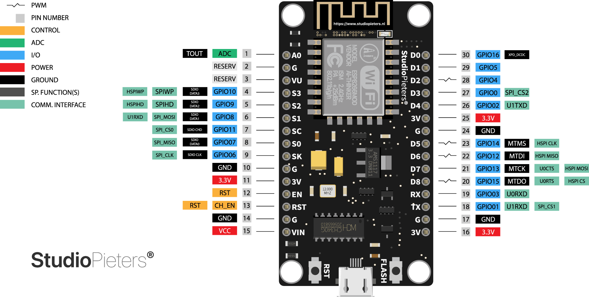

# ESP8266 Robot Control with Web Interface

This project enables control of a robot with obstacle avoidance and a robot arm through a web interface using an ESP8266. The controller connects to Wi-Fi and accepts HTTP commands to manage the motor, robot arm, and sensors.

## Features

### Main
- **Wi-Fi Control**: Control the robot over a Wi-Fi network using a web interface.
- **Obstacle Avoidance**: Uses ultrasonic sensor data to automatically avoid obstacles.
- **Robot Arm Control**: Manage various robotic arm movements, including a gripper, base rotation, and joint movements.
- **Configurable Speed**: Set motor speed through the web interface.
- **Position Management**: Save and execute robot arm positions, along with predefined actions like scanning, picking, and waving.

### Parts

#### Body Control
- **Directional Movement**
  - Forward/Backward movement
  - Left/Right turns
  - Rotate left/right
  - Emergency stop
- **Speed Control**
  - Adjustable speed via slider (0-255)
- **Obstacle Avoidance**
  - Enable/Disable obstacle avoidance
  - Autonomous navigation mode

#### Arm Control
- **Joint Control**
  - Base rotation (left/right)
  - Shoulder movement (up/down)
  - Elbow movement (up/down)
  - Gripper control (open/close)
- **Pre-defined Movements**
  - Home position
  - Scan position
  - Pick object
  - Drop object
  - Wave gesture
- **Position Memory**
  - Save up to 3 custom positions
  - Load saved positions
- **Command Recording**
  - Record movement sequences
  - Play recorded sequences
  - Clear recordings

## Hardware Requirements

- **ESP8266 (NodeMCU or similar)**
- **Motor Driver (L298N recommended)**
- **Ultrasonic Sensor (HC-SR04)**
- **Servos (for robot arm joints and gripper)**
- **Power Supply (suitable for motors and servos)**

## Pin Configuration

Below is the ESP8266 GPIO setup for controlling motors, an ultrasonic sensor, and a robot arm. This includes alternative pin aliases often found on NodeMCU boards, such as `SD2`, `SD3`, `SD_CLK`, and `SD_CMD`.

### Motor Controller Pins

| Component             | Board Pin | GPIO   | NodeMCU Alias | Description                           |
|-----------------------|-----------|--------|---------------|---------------------------------------|
| Motor 1 IN1           | D1        | GPIO5  | D1            | Motor 1 Direction Control Pin 1       |
| Motor 1 IN2           | D2        | GPIO4  | D2            | Motor 1 Direction Control Pin 2       |
| Motor 2 IN1           | D3        | GPIO0  | D3            | Motor 2 Direction Control Pin 1       |
| Motor 2 IN2           | D4        | GPIO2  | D4            | Motor 2 Direction Control Pin 2       |
| Motor 1 Enable (ENA)  | D5        | GPIO14 | D5            | PWM pin for Motor 1 speed control     |
| Motor 2 Enable (ENB)  | D6        | GPIO12 | D6            | PWM pin for Motor 2 speed control     |

### Ultrasonic Sensor Pins

| Component             | Board Pin | GPIO   | NodeMCU Alias | Description                           |
|-----------------------|-----------|--------|---------------|---------------------------------------|
| Trigger Pin           | D7        | GPIO13 | D7            | Trigger for distance measurement      |
| Echo Pin              | D8        | GPIO15 | D8            | Echo to receive distance              |

### Robot Arm Pins

| Component             | Board Pin | GPIO   | NodeMCU Alias | Description                           |
|-----------------------|-----------|--------|---------------|---------------------------------------|
| Base Servo            | D0        | GPIO16 | D0            | Base rotation control                 |
| Shoulder Servo        | RX        | GPIO3  | RX            | Shoulder joint control (ESP8266 RX)   |
| Elbow Servo           | TX        | GPIO1  | TX            | Elbow joint control (ESP8266 TX)      |
| Gripper Servo         | Flash     | GPIO9  | SD2           | Gripper open/close control            |

**Additional Pins and Notes:**
- **SD2 (GPIO9)** and **SD3 (GPIO10)** are typically connected to the flash memory. Use them with caution, as these can interfere with flash operations.
- **SD_CLK (GPIO6)**, **SD_CMD (GPIO11)**, **SD_DATA0-3 (GPIO7-10)**: Reserved for internal flash operations on most boards, so avoid using these for general I/O.

**Note**: UART pins (D9, D10, D11) are used for serial communication, which might conflict with debugging output if connected to other peripherals.

#### GPIO images



## Software Requirements

- **Arduino IDE** with ESP8266 support
- **Libraries**:
  - `ESP8266WiFi.h`: For Wi-Fi connectivity
  - `ESP8266WebServer.h`: For creating the HTTP server
  - Custom libraries for `MotorController`, `UltrasonicSensor`, `ObstacleAvoidance`, and `RobotArm` (provided in the codebase)

## Setup Instructions

1. **Clone Repository**:
   ```bash
   git clone https://github.com/lily-osp/esp8266-robot-control.git
   cd esp8266-robot-control
   ```

2. **Install Libraries**: Ensure the required libraries are installed in the Arduino IDE.

3. **Configure Wi-Fi**:
   - Open `main.ino` in the Arduino IDE.
   - Replace `ssid` and `password` with your Wi-Fi credentials.
    ```cpp
    const char* ssid = "YOUR_WIFI_SSID";
    const char* password = "YOUR_WIFI_PASSWORD";
    ```

4. **Upload the Code**:
   - Connect the ESP8266 to your computer.
   - Upload the code to the ESP8266 through the Arduino IDE.

5. **Connect the Hardware**:
   - Wire up the components based on the pinout tables above.
   - Use a power supply compatible with the ESP8266 and motors/servos.

6. **Access the Web Interface**:
   - After uploading, open the Serial Monitor to see the assigned IP address.
   - Open a web browser and enter the ESP8266’s IP to access the control interface.

## Web Interface and Commands

The web interface provides buttons and controls for the following actions:

- **Movement Commands**: `mv` (move forward), `bk` (move backward), `lt` (turn left), `rt` (turn right), `rl` (rotate left), `rr` (rotate right), `st` (stop).
- **Speed Control**: `spd [value]` - Set the motor speed, where `[value]` is a number between 0-255.
- **Obstacle Avoidance**:
  - `oa on`: Enable obstacle avoidance mode.
  - `oa off`: Disable obstacle avoidance.
  - `oa nav`: Start navigation using obstacle detection.
- **Robot Arm Commands**:
  - `b [dir]`: Move base. `dir` can be `f` (forward), `b` (back), `l` (left), or `r` (right).
  - `s [dir]`: Move shoulder. `dir` can be `u` (up), `d` (down).
  - `e [dir]`: Move elbow. `dir` can be `u` (up), `d` (down).
  - `g [dir]`: Move gripper. `dir` can be `o` (open), `c` (close).
- **Position and Recording**:
  - `stream`: Start recording arm movements.
  - `m pos [number]`: Save current position as a specific number.
  - `m save [number]`: Move to a saved position.
  - `m [action]`: Perform predefined actions, e.g., `home`, `scan`, `pick`, `drop`, `wave`, etc.

### UI preview

<div align="center">
  <div style="display: flex; justify-content: center; gap: 20px; margin-bottom: 20px;">
    
    
  </div>
  <p><em>Left: Body Control Interface - Right: Arm Control Interface</em></p>
</div>

### Control Commands

Here’s the completed table with example usage for each command:

| Category             | Command      | Description                          | Example Usage                                       |
|----------------------|--------------|--------------------------------------|-----------------------------------------------------|
| **Body Movement**    | `mv`         | Move forward                         | `http://<esp_ip>/command?cmd=mv`                    |
|                      | `bk`         | Move backward                        | `http://<esp_ip>/command?cmd=bk`                    |
|                      | `lt`         | Turn left                            | `http://<esp_ip>/command?cmd=lt`                    |
|                      | `rt`         | Turn right                           | `http://<esp_ip>/command?cmd=rt`                    |
|                      | `rl`         | Rotate left                          | `http://<esp_ip>/command?cmd=rl`                    |
|                      | `rr`         | Rotate right                         | `http://<esp_ip>/command?cmd=rr`                    |
|                      | `st`         | Stop                                 | `http://<esp_ip>/command?cmd=st`                    |
|                      | `spd X`      | Set speed (X: 0-255)                 | `http://<esp_ip>/command?cmd=spd 150`               |
| **Arm Movement**     | `b +/-`      | Base rotation                        | `http://<esp_ip>/command?cmd=b +` or `cmd=b -`      |
|                      | `s +/-`      | Shoulder movement                    | `http://<esp_ip>/command?cmd=s +` or `cmd=s -`      |
|                      | `e +/-`      | Elbow movement                       | `http://<esp_ip>/command?cmd=e +` or `cmd=e -`      |
|                      | `g o/c`      | Gripper open (`o`) / close (`c`)     | `http://<esp_ip>/command?cmd=g o` or `cmd=g c`      |
| **Pre-defined Movements** | `m h`   | Home position                        | `http://<esp_ip>/command?cmd=m h`                   |
|                      | `m s`        | Scan position                        | `http://<esp_ip>/command?cmd=m s`                   |
|                      | `m p`        | Pick object                          | `http://<esp_ip>/command?cmd=m p`                   |
|                      | `m d`        | Drop object                          | `http://<esp_ip>/command?cmd=m d`                   |
|                      | `m w`        | Wave                                 | `http://<esp_ip>/command?cmd=m w`                   |
| **Position Memory**  | `m pos X`    | Save position (X: 1-3)               | `http://<esp_ip>/command?cmd=m pos 1`               |
|                      | `m save X`   | Load position (X: 1-3)               | `http://<esp_ip>/command?cmd=m save 1`              |
| **Recording**        | `stream`     | Start recording                      | `http://<esp_ip>/command?cmd=stream`                |
|                      | `done`       | Stop recording                       | `http://<esp_ip>/command?cmd=done`                  |
|                      | `play`       | Play recording                       | `http://<esp_ip>/command?cmd=play`                  |
|                      | `clear`      | Clear recording                      | `http://<esp_ip>/command?cmd=clear`                 |

### Additional Examples

- **Move the robot forward**: `http://<esp_ip>/command?cmd=mv`
- **Set motor speed to 150**: `http://<esp_ip>/command?cmd=spd 150`
- **obstacle avoidance**: `http://<esp_ip>/command?cmd=oa on` or `cmd=oa off` or `cmd=oa nav`

## User Interface

The interface features a modern, retro-styled design with:
- Responsive layout
- Tab-based navigation
- Touch-friendly controls
- Visual feedback
- Dark theme
- Intuitive icons
- Status notifications

## Troubleshooting

- **Cannot Connect to Wi-Fi**: Double-check the SSID and password. Restart the ESP8266.
- **Commands Not Working**: Ensure all components are wired correctly. Check for any loose connections or power supply issues.
- **Servo or Motor Issues**: Verify that the power supply is adequate for servos and motors.

### Common Issues
1. **Can't connect to WiFi**
   - Verify credentials
   - Check WiFi signal strength
   - Ensure ESP32 is powered properly

2. **Commands not responding**
   - Check serial monitor for errors
   - Verify IP address
   - Check network connectivity

3. **UI not loading**
   - Clear browser cache
   - Check browser console for errors
   - Verify all CDN resources are loading

## Notes

- **Power Considerations**: Ensure that the ESP8266 has a stable 3.3V power supply. Motors and servos may require separate power sources if they draw significant current.
- **Pin Limitations**: The ESP8266 has limited PWM pins, so configure carefully based on your hardware setup.

## License

This project is licensed under the [MIT License](LICENSE).
